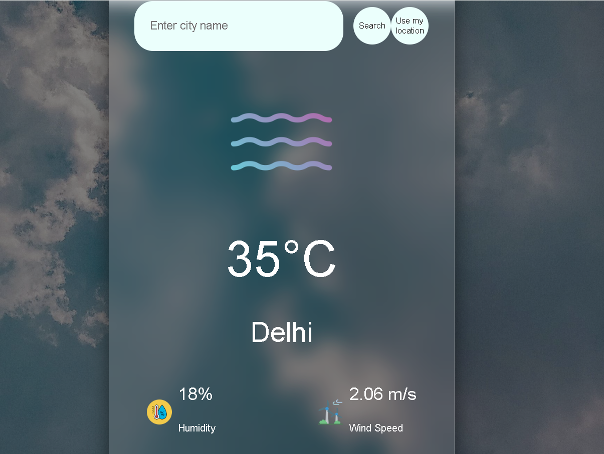

# 🌦️ Weather App

A simple weather application that allows users to check real-time weather data using city search or their current location.

---

## 🚀 Features

- 🌍 Search weather by city name  
- 📍 Get weather using current location  
- 📊 Hourly forecast display  
- 🗺️ Map integration using latitude & longitude  
- ⏳ Loading state handling  
- ❌ Error handling for invalid input  

---

## 🛠️ Tech Stack

- HTML  
- CSS  
- JavaScript  
- OpenWeather API  

---

## 📸 Screenshots

---

## ⚙️ How it works

- User enters a city or clicks "Use my location"
- App fetches data from OpenWeather API
- Data is processed and displayed on UI
- Map updates using coordinates

---

## 📌 What I learned

- API integration using fetch and async/await  
- DOM manipulation  
- Handling loading and error states  
- Working with geolocation API  

---

## 🔗 Live Demo

https://priyanshu-weather-dashboard-55571w.netlify.app

---

## 📁 GitHub Repository

https://github.com/priyanshu-573/weather-app

---

## ✨ Future Improvements

- Better UI/UX design  
- Add temperature unit toggle (°C/°F)  
- Improve map accuracy  
- Add 5-day forecast  

---

## 👨‍💻 Author

Priyanshu